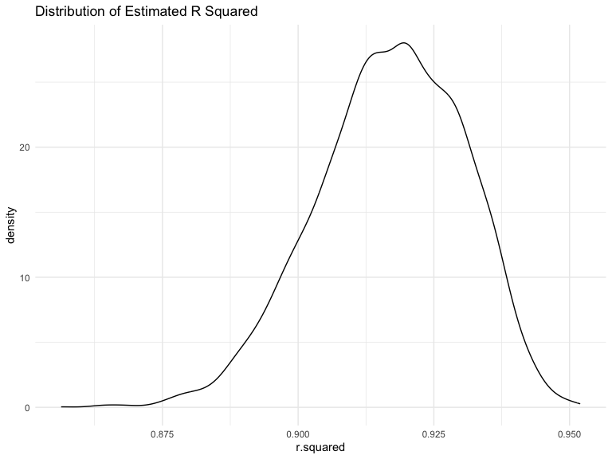
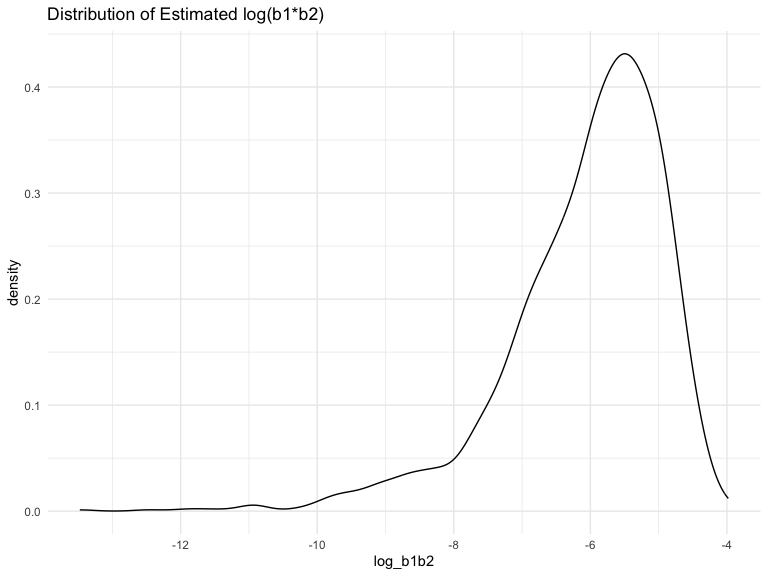
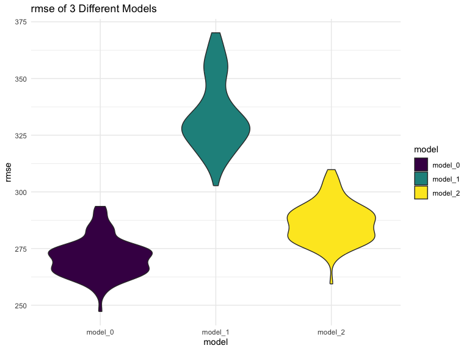

p8105_hw6_ml5018
================
Luan Mengxiao
2023-11-17

This is a R Markdown document for homework 6.

Load the package to be used for data processing.

``` r
library(tidyverse)
```

    ## ── Attaching core tidyverse packages ──────────────────────── tidyverse 2.0.0 ──
    ## ✔ dplyr     1.1.3     ✔ readr     2.1.4
    ## ✔ forcats   1.0.0     ✔ stringr   1.5.0
    ## ✔ ggplot2   3.4.3     ✔ tibble    3.2.1
    ## ✔ lubridate 1.9.2     ✔ tidyr     1.3.0
    ## ✔ purrr     1.0.2     
    ## ── Conflicts ────────────────────────────────────────── tidyverse_conflicts() ──
    ## ✖ dplyr::filter() masks stats::filter()
    ## ✖ dplyr::lag()    masks stats::lag()
    ## ℹ Use the conflicted package (<http://conflicted.r-lib.org/>) to force all conflicts to become errors

``` r
library(modelr)

knitr::opts_chunk$set(
    echo = TRUE,
    warning = FALSE,
    fig.width = 8, 
  fig.height = 6,
  out.width = "90%"
)

options(
  ggplot2.continuous.colour = "viridis",
  ggplot2.continuous.fill = "viridis"
)

scale_colour_discrete = scale_colour_viridis_d
scale_fill_discrete = scale_fill_viridis_d

theme_set(theme_minimal() + theme(legend.position = "right"))
```

# Problem 1

## data import

The Washington Post has gathered data on homicides in 50 large U.S.
cities and made the data available through a GitHub repository.

``` r
homicide_df = 
  read_csv("data/homicide-data.csv") |>
  janitor::clean_names()
```

    ## Rows: 52179 Columns: 12
    ## ── Column specification ────────────────────────────────────────────────────────
    ## Delimiter: ","
    ## chr (9): uid, victim_last, victim_first, victim_race, victim_age, victim_sex...
    ## dbl (3): reported_date, lat, lon
    ## 
    ## ℹ Use `spec()` to retrieve the full column specification for this data.
    ## ℹ Specify the column types or set `show_col_types = FALSE` to quiet this message.

## data pre-processing

Create a `city_state` variable (e.g. “Baltimore, MD”), and a binary
variable indicating whether the homicide is solved. Omit cities Dallas,
TX; Phoenix, AZ; and Kansas City, MO – these don’t report victim race.
Also omit Tulsa, AL – this is a data entry mistake. For this problem,
limit your analysis those for whom `victim_race` is `white` or `black`.
Be sure that `victim_age` is numeric.

``` r
homicide_df = 
  homicide_df |>
  mutate(city_state = str_c(city, state, sep = ", "),
         solved = ifelse(disposition == "Closed by arrest", 1, 0)) |>
  filter(city_state != "Dallas, TX",
         city_state != "Phoenix, AZ",
         city_state != "Kansas City, MO",
         city_state != "Tulsa, AL") |>
  filter(victim_race %in% c("White", "Black")) |>
  mutate(victim_age = as.numeric(victim_age))
```

## logistic regression for Baltimore

For the city of Baltimore, MD, use the `glm` function to fit a logistic
regression with resolved vs unresolved as the outcome and victim age,
sex and race as predictors. Save the output of `glm` as an R object;
apply the `broom::tidy` to this object; and obtain the estimate and
confidence interval of the adjusted odds ratio for solving homicides
comparing male victims to female victims keeping all other variables
fixed.

``` r
baltimore_df = 
  homicide_df |>
  filter(city_state == "Baltimore, MD") |>
  select(solved, victim_age, victim_sex, victim_race)

baltimore_logistic = 
  baltimore_df |>
  glm(solved ~ victim_age + victim_sex + victim_race, 
      data = _,
      family = binomial())
baltimore_logistic
```

    ## 
    ## Call:  glm(formula = solved ~ victim_age + victim_sex + victim_race, 
    ##     family = binomial(), data = baltimore_df)
    ## 
    ## Coefficients:
    ##      (Intercept)        victim_age    victim_sexMale  victim_raceWhite  
    ##         0.309981         -0.006727         -0.854463          0.841756  
    ## 
    ## Degrees of Freedom: 2752 Total (i.e. Null);  2749 Residual
    ## Null Deviance:       3568 
    ## Residual Deviance: 3493  AIC: 3501

``` r
save(baltimore_logistic, file = "results/baltimore_logistic.RData")

baltimore_logistic |>
  broom::tidy() |>
  knitr::kable()
```

| term             |   estimate | std.error | statistic |   p.value |
|:-----------------|-----------:|----------:|----------:|----------:|
| (Intercept)      |  0.3099810 | 0.1712948 |  1.809635 | 0.0703525 |
| victim_age       | -0.0067272 | 0.0033235 | -2.024124 | 0.0429574 |
| victim_sexMale   | -0.8544628 | 0.1381762 | -6.183864 | 0.0000000 |
| victim_raceWhite |  0.8417563 | 0.1747162 |  4.817851 | 0.0000015 |

``` r
# alpha = 0.05
baltimore_logistic |>
  broom::tidy() |>
  filter(term == "victim_sexMale") |>
  mutate(
    OR = exp(estimate),
    OR_CI_lower = exp(estimate - qnorm(0.975) * std.error),
    OR_CI_upper = exp(estimate + qnorm(0.975) * std.error)) |>
    select(term, estimate, OR, OR_CI_lower, OR_CI_upper) |>
    knitr::kable()
```

| term           |   estimate |        OR | OR_CI_lower | OR_CI_upper |
|:---------------|-----------:|----------:|------------:|------------:|
| victim_sexMale | -0.8544628 | 0.4255117 |   0.3245606 |   0.5578627 |

## logistic regression for all cities

Now run `glm` for each of the cities in your dataset, and extract the
adjusted odds ratio (and CI) for solving homicides comparing male
victims to female victims. Do this within a “tidy” pipeline, making use
of `purrr::map`, list columns, and unnest as necessary to create a
dataframe with estimated ORs and CIs for each city.

``` r
get_logistic = function(citystate){
  homicide_df |>
    filter(city_state == citystate) |>
    glm(solved ~ victim_age + victim_sex + victim_race, 
      data = _,
      family = binomial()) |>
    broom::tidy() |>
    filter(term == "victim_sexMale") |>
    mutate(
    OR = exp(estimate),
    OR_CI_lower = exp(estimate - qnorm(0.975) * std.error),
    OR_CI_upper = exp(estimate + qnorm(0.975) * std.error)) |>
    select(term, estimate, OR, OR_CI_lower, OR_CI_upper)
}

citystate_name = 
  homicide_df |>
  select(city_state) |>
  unique()
homicide_results = 
  citystate_name |>
  mutate(logistic_models = map(city_state, get_logistic)) |>
  unnest(logistic_models)
homicide_results |> knitr::kable()
```

| city_state         | term           |   estimate |        OR | OR_CI_lower | OR_CI_upper |
|:-------------------|:---------------|-----------:|----------:|------------:|------------:|
| Albuquerque, NM    | victim_sexMale |  0.5695658 | 1.7674995 |   0.8306697 |   3.7608866 |
| Atlanta, GA        | victim_sexMale |  0.0000771 | 1.0000771 |   0.6836060 |   1.4630567 |
| Baltimore, MD      | victim_sexMale | -0.8544628 | 0.4255117 |   0.3245606 |   0.5578627 |
| Baton Rouge, LA    | victim_sexMale | -0.9638036 | 0.3814393 |   0.2092555 |   0.6953027 |
| Birmingham, AL     | victim_sexMale | -0.1392445 | 0.8700153 |   0.5742995 |   1.3179997 |
| Boston, MA         | victim_sexMale | -0.3945382 | 0.6739912 |   0.3560044 |   1.2760073 |
| Buffalo, NY        | victim_sexMale | -0.6528301 | 0.5205704 |   0.2897736 |   0.9351908 |
| Charlotte, NC      | victim_sexMale | -0.1234140 | 0.8838976 |   0.5569976 |   1.4026540 |
| Chicago, IL        | victim_sexMale | -0.8913586 | 0.4100982 |   0.3359909 |   0.5005509 |
| Cincinnati, OH     | victim_sexMale | -0.9167216 | 0.3998277 |   0.2360870 |   0.6771324 |
| Columbus, OH       | victim_sexMale | -0.6302015 | 0.5324845 |   0.3782605 |   0.7495886 |
| Denver, CO         | victim_sexMale | -0.7359252 | 0.4790620 |   0.2364324 |   0.9706808 |
| Detroit, MI        | victim_sexMale | -0.5406884 | 0.5823472 |   0.4622037 |   0.7337204 |
| Durham, NC         | victim_sexMale | -0.2078222 | 0.8123514 |   0.3920426 |   1.6832732 |
| Fort Worth, TX     | victim_sexMale | -0.4020006 | 0.6689803 |   0.3969429 |   1.1274535 |
| Fresno, CA         | victim_sexMale |  0.2890547 | 1.3351647 |   0.5805084 |   3.0708680 |
| Houston, TX        | victim_sexMale | -0.3410458 | 0.7110264 |   0.5576740 |   0.9065485 |
| Indianapolis, IN   | victim_sexMale | -0.0847648 | 0.9187284 |   0.6794382 |   1.2422937 |
| Jacksonville, FL   | victim_sexMale | -0.3287619 | 0.7198144 |   0.5365379 |   0.9656965 |
| Las Vegas, NV      | victim_sexMale | -0.1775635 | 0.8373078 |   0.6076789 |   1.1537086 |
| Long Beach, CA     | victim_sexMale | -0.8910706 | 0.4102163 |   0.1555176 |   1.0820480 |
| Los Angeles, CA    | victim_sexMale | -0.4126686 | 0.6618816 |   0.4581330 |   0.9562446 |
| Louisville, KY     | victim_sexMale | -0.7122187 | 0.4905546 |   0.3047235 |   0.7897119 |
| Memphis, TN        | victim_sexMale | -0.3240426 | 0.7232194 |   0.5291759 |   0.9884168 |
| Miami, FL          | victim_sexMale | -0.6631265 | 0.5152379 |   0.3044860 |   0.8718632 |
| Milwaukee, wI      | victim_sexMale | -0.3186463 | 0.7271327 |   0.4987125 |   1.0601737 |
| Minneapolis, MN    | victim_sexMale | -0.0544998 | 0.9469587 |   0.4782920 |   1.8748603 |
| Nashville, TN      | victim_sexMale |  0.0336649 | 1.0342379 |   0.6847195 |   1.5621697 |
| New Orleans, LA    | victim_sexMale | -0.5362506 | 0.5849373 |   0.4217673 |   0.8112333 |
| New York, NY       | victim_sexMale | -1.3378936 | 0.2623978 |   0.1379476 |   0.4991216 |
| Oakland, CA        | victim_sexMale | -0.5743302 | 0.5630819 |   0.3650953 |   0.8684340 |
| Oklahoma City, OK  | victim_sexMale | -0.0262673 | 0.9740747 |   0.6240911 |   1.5203254 |
| Omaha, NE          | victim_sexMale | -0.9610630 | 0.3824861 |   0.2029694 |   0.7207769 |
| Philadelphia, PA   | victim_sexMale | -0.7006239 | 0.4962756 |   0.3776176 |   0.6522192 |
| Pittsburgh, PA     | victim_sexMale | -0.8422210 | 0.4307528 |   0.2651007 |   0.6999151 |
| Richmond, VA       | victim_sexMale |  0.0060338 | 1.0060520 |   0.4979572 |   2.0325857 |
| San Antonio, TX    | victim_sexMale | -0.3500966 | 0.7046200 |   0.3976620 |   1.2485211 |
| Sacramento, CA     | victim_sexMale | -0.4022077 | 0.6688418 |   0.3347180 |   1.3364962 |
| Savannah, GA       | victim_sexMale | -0.1427374 | 0.8669817 |   0.4222721 |   1.7800309 |
| San Bernardino, CA | victim_sexMale | -0.6924587 | 0.5003444 |   0.1712118 |   1.4621916 |
| San Diego, CA      | victim_sexMale | -0.8842476 | 0.4130248 |   0.1995247 |   0.8549795 |
| San Francisco, CA  | victim_sexMale | -0.4983435 | 0.6075362 |   0.3167940 |   1.1651114 |
| St. Louis, MO      | victim_sexMale | -0.3521615 | 0.7031665 |   0.5303697 |   0.9322613 |
| Stockton, CA       | victim_sexMale |  0.3013833 | 1.3517273 |   0.6211456 |   2.9416076 |
| Tampa, FL          | victim_sexMale | -0.2135610 | 0.8077029 |   0.3477583 |   1.8759697 |
| Tulsa, OK          | victim_sexMale | -0.0245290 | 0.9757694 |   0.6135935 |   1.5517210 |
| Washington, DC     | victim_sexMale | -0.3708154 | 0.6901713 |   0.4683886 |   1.0169685 |

## plot

Create a plot that shows the estimated ORs and CIs for each city.
Organize cities according to estimated OR, and comment on the plot.

``` r
homicide_results =
  homicide_results |>
  arrange(OR)

homicide_results |>
  ggplot(aes(x = fct_reorder(city_state, OR), y = OR)) +
  geom_point() +
  geom_errorbar(aes(ymin = OR_CI_lower, ymax = OR_CI_upper)) +
  labs(
    x = "city, state",
    y = "estimated OR and 95% CI",
    title = "Estimated ORs and CIs for Each City"
  ) +
  theme(axis.text.x = element_text(hjust = 1, angle = 60, size = 8))
```


It can be concluded that homicides with a male victim are less likely to
be solved compared with those with a female victim, since the estimated
odds ratio in most cities are less than 1. Most of the confidence
intervals for this odds ratio contain the null value 1 even for those
with a estimate higher than 1, indicating that only for those cities
whose CI does not contain 1, there is a significant difference in the
solved rate of homicides with victims of different sex.

# Problem 2

## data import

For this problem, we’ll use the Central Park weather data similar to
data we’ve seen elsewhere.

``` r
weather_df = 
  rnoaa::meteo_pull_monitors(
    c("USW00094728"),
    var = c("PRCP", "TMIN", "TMAX"), 
    date_min = "2022-01-01",
    date_max = "2022-12-31") |>
  mutate(
    name = recode(id, USW00094728 = "CentralPark_NY"),
    tmin = tmin / 10,
    tmax = tmax / 10) |>
  select(name, id, everything())
```

    ## using cached file: /Users/luanmengxiao/Library/Caches/org.R-project.R/R/rnoaa/noaa_ghcnd/USW00094728.dly

    ## date created (size, mb): 2023-09-28 10:20:23.237516 (8.524)

    ## file min/max dates: 1869-01-01 / 2023-09-30

## bootstrap

The boostrap is helpful when you’d like to perform inference for a
parameter / value / summary that doesn’t have an easy-to-write-down
distribution in the usual repeated sampling framework. We’ll focus on a
simple linear regression with `tmax` as the response with `tmin` and
`prcp` as the predictors, and are interested in the distribution of two
quantities estimated from these data:

- r̂2
- log(β̂1∗β̂2)

Use 5000 bootstrap samples and, for each bootstrap sample, produce
estimates of these two quantities. Plot the distribution of your
estimates, and describe these in words. Using the 5000 bootstrap
estimates, identify the 2.5% and 97.5% quantiles to provide a 95%
confidence interval for r̂2 and log(β̂0∗β̂1). Note: `broom::glance()` is
helpful for extracting r̂2 from a fitted regression, and `broom::tidy()`
(with some additional wrangling) should help in computing log(β̂1∗β̂2).

## estimates

``` r
bootstrap_df =
  weather_df |>
  bootstrap(n = 5000) |>
  mutate(models = map(strap, ~lm(tmax ~ tmin + prcp, data = .x)))
  
r_squared_df = 
  bootstrap_df |>
  mutate(results = map(models, broom::glance)) |>
  select(-strap, -models) |>
  unnest(results)

log_b1b2_df = 
  bootstrap_df |>
  mutate(results = map(models, broom::tidy)) |>
  select(-strap, -models) |>
  unnest(results) |>
  select(id = .id, term, estimate) |>
  pivot_wider(
    names_from = term,
    values_from = estimate
  ) |>
  mutate(log_b1b2 = log(tmin * prcp))

r_squared_df |>
  summarize(r2_estimate = mean(r.squared))
```

    ## # A tibble: 1 × 1
    ##   r2_estimate
    ##         <dbl>
    ## 1       0.917

``` r
log_b1b2_df |>
  summarize(log_b1b2_estimate = mean(log_b1b2, na.rm = TRUE))
```

    ## # A tibble: 1 × 1
    ##   log_b1b2_estimate
    ##               <dbl>
    ## 1             -6.10

## plots

``` r
r_squared_df |>
  ggplot(aes(x = r.squared)) +
  geom_density() +
  labs(
    title = "Distribution of Estimated R Squared"
  )
```



``` r
log_b1b2_df |>
  ggplot(aes(x = log_b1b2)) +
  geom_density() +
  labs(
    title = "Distribution of Estimated log(b1*b2)"
  )
```



It can be concluded from the density plots that the distribution of both
of the quantities are left-skewed, with log(b1\*b2) much more skewed
than r squared. Also, NAs are created during the calculation process due
to some negative values in logarithms, which may impact the overall
distribution of the latter quantity. Baesd on the plots in hand we can
tell that the median of the two quantities are approximately 0.92 and
-5, respectively.

## quantiles

``` r
r_squared_df |>
  summarize(
    r2_CI_lower = quantile(r.squared, 0.025),
    r2_CI_upper = quantile(r.squared, 0.975)
  ) |>
  knitr::kable()
```

| r2_CI_lower | r2_CI_upper |
|------------:|------------:|
|   0.8880187 |   0.9403638 |

``` r
log_b1b2_df |>
  summarize(
    log_b1b2_CI_lower = quantile(log_b1b2, 0.025, na.rm = TRUE),
    log_b1b2_CI_upper = quantile(log_b1b2, 0.975, na.rm = TRUE)
  ) |>
  knitr::kable()
```

| log_b1b2_CI_lower | log_b1b2_CI_upper |
|------------------:|------------------:|
|         -9.088211 |         -4.585832 |

# Problem 3

## data import and cleaning

In this problem, you will analyze data gathered to understand the
effects of several variables on a child’s birthweight.

Load and clean the data for regression analysis (i.e. convert numeric to
factor where appropriate, check for missing data, etc.).

``` r
bwt_df = 
  read_csv("data/birthweight.csv") |>
  janitor::clean_names() |>
  mutate(
    babysex = as.factor(babysex),
    frace = as.factor(frace),
    malform = as.factor(malform),
    mrace = as.factor(mrace)
  )
```

    ## Rows: 4342 Columns: 20
    ## ── Column specification ────────────────────────────────────────────────────────
    ## Delimiter: ","
    ## dbl (20): babysex, bhead, blength, bwt, delwt, fincome, frace, gaweeks, malf...
    ## 
    ## ℹ Use `spec()` to retrieve the full column specification for this data.
    ## ℹ Specify the column types or set `show_col_types = FALSE` to quiet this message.

``` r
sum(is.na(bwt_df))
```

    ## [1] 0

## regression model

Propose a regression model for birthweight. This model may be based on a
hypothesized structure for the factors that underly birthweight, on a
data-driven model-building process, or a combination of the two.
Describe your modeling process and show a plot of model residuals
against fitted values – use `add_predictions` and `add_residuals` in
making this plot.

``` r
full_model = 
  bwt_df |>
  lm(bwt ~ ., data =_)
full_model |>
  broom::tidy() |>
  knitr::kable()
```

| term        |      estimate |   std.error |  statistic |   p.value |
|:------------|--------------:|------------:|-----------:|----------:|
| (Intercept) | -6265.3914076 | 660.4010631 | -9.4872522 | 0.0000000 |
| babysex2    |    28.7073088 |   8.4652447 |  3.3911966 | 0.0007021 |
| bhead       |   130.7781455 |   3.4523248 | 37.8811826 | 0.0000000 |
| blength     |    74.9535780 |   2.0216656 | 37.0751613 | 0.0000000 |
| delwt       |     4.1007326 |   0.3948202 | 10.3863301 | 0.0000000 |
| fincome     |     0.2898207 |   0.1795416 |  1.6142265 | 0.1065513 |
| frace2      |    14.3312853 |  46.1501283 |  0.3105362 | 0.7561682 |
| frace3      |    21.2361118 |  69.2959907 |  0.3064551 | 0.7592729 |
| frace4      |   -46.9962310 |  44.6782159 | -1.0518824 | 0.2929123 |
| frace8      |     4.2969242 |  74.0740827 |  0.0580085 | 0.9537446 |
| gaweeks     |    11.5493872 |   1.4653680 |  7.8815609 | 0.0000000 |
| malform1    |     9.7649680 |  70.6258929 |  0.1382633 | 0.8900388 |
| menarche    |    -3.5507723 |   2.8950777 | -1.2264860 | 0.2200827 |
| mheight     |     9.7874130 |  10.3115672 |  0.9491683 | 0.3425881 |
| momage      |     0.7593479 |   1.2221417 |  0.6213256 | 0.5344182 |
| mrace2      |  -151.4354038 |  46.0453432 | -3.2888321 | 0.0010141 |
| mrace3      |   -91.3866079 |  71.9189677 | -1.2706885 | 0.2039079 |
| mrace4      |   -56.4787268 |  45.1368828 | -1.2512766 | 0.2109013 |
| parity      |    95.5411137 |  40.4792711 |  2.3602479 | 0.0183069 |
| pnumlbw     |            NA |          NA |         NA |        NA |
| pnumsga     |            NA |          NA |         NA |        NA |
| ppbmi       |     4.3537865 |  14.8913292 |  0.2923706 | 0.7700173 |
| ppwt        |    -3.4715550 |   2.6121254 | -1.3290155 | 0.1839131 |
| smoken      |    -4.8543629 |   0.5870549 | -8.2690107 | 0.0000000 |
| wtgain      |            NA |          NA |         NA |        NA |

``` r
stepwise_model = 
  full_model |>
  MASS::stepAIC(object = _, trace = FALSE, direction = "backward")
stepwise_model |>
  broom::tidy() |>
  knitr::kable()
```

| term        |      estimate |   std.error |  statistic |   p.value |
|:------------|--------------:|------------:|-----------:|----------:|
| (Intercept) | -6098.8219113 | 137.5463421 | -44.340124 | 0.0000000 |
| babysex2    |    28.5580171 |   8.4548958 |   3.377690 | 0.0007374 |
| bhead       |   130.7770408 |   3.4465672 |  37.944144 | 0.0000000 |
| blength     |    74.9471109 |   2.0190479 |  37.120027 | 0.0000000 |
| delwt       |     4.1067316 |   0.3920592 |  10.474775 | 0.0000000 |
| fincome     |     0.3180229 |   0.1747477 |   1.819898 | 0.0688436 |
| gaweeks     |    11.5924873 |   1.4620657 |   7.928842 | 0.0000000 |
| mheight     |     6.5940377 |   1.7848817 |   3.694383 | 0.0002231 |
| mrace2      |  -138.7924801 |   9.9070869 | -14.009414 | 0.0000000 |
| mrace3      |   -74.8867755 |  42.3146313 |  -1.769761 | 0.0768374 |
| mrace4      |  -100.6781427 |  19.3246910 |  -5.209819 | 0.0000002 |
| parity      |    96.3046933 |  40.3362158 |   2.387549 | 0.0170038 |
| ppwt        |    -2.6755853 |   0.4273585 |  -6.260752 | 0.0000000 |
| smoken      |    -4.8434197 |   0.5855757 |  -8.271210 | 0.0000000 |

``` r
bwt_df |>
  add_predictions(stepwise_model) |>
  add_residuals(stepwise_model) |>
  ggplot(aes(x = pred, y = resid)) +
  geom_point() +
  labs(
    x = "fitted values(predictions)",
    y = "residuals",
    title = "Residuals versus Fitted Values"
  )
```


Using `stepwiseAIC` function to perform stepwise model selection based
on a full model, we can conclude from the results that variables to be
included in the model are: `babysex`, `bhead`, `blength`, `delwt`,
`fincome`, `gaweeks`, `mheight`, `mrace`, `parity`, `ppwt`, `smoken`.

## model comparison

Compare your model to two others:

- One using length at birth and gestational age as predictors (main
  effects only)
- One using head circumference, length, sex, and all interactions
  (including the three-way interaction) between these

Make this comparison in terms of the cross-validated prediction error;
use `crossv_mc` and functions in `purrr` as appropriate.

``` r
#model_1 = lm(bwt ~ blength + gaweeks, data = bwt_df)
#model_2 = lm(bwt ~ bhead * blength * babysex, data = bwt_df)

cv_df = 
  crossv_mc(bwt_df, 100) |>
  mutate(
    train = map(train, as.tibble),
    test = map(test, as.tibble)
  )

comparison_df = 
  cv_df |>
  mutate(
    model_0 = map(train, ~lm(bwt ~ babysex + bhead + blength + delwt + fincome + gaweeks + mheight + mrace + parity + ppwt + smoken, data = bwt_df)),
    model_1 = map(train, ~lm(bwt ~ blength + gaweeks, data = bwt_df)),
    model_2 = map(train, ~lm(bwt ~ bhead * blength * babysex, data = bwt_df))
  ) |>
  mutate(
    rmse_0 = map2_dbl(model_0, test, \(mod, df) rmse(model = mod, data = df)),
    rmse_1 = map2_dbl(model_1, test, \(mod, df) rmse(model = mod, data = df)),
    rmse_2 = map2_dbl(model_2, test, \(mod, df) rmse(model = mod, data = df))
  )

comparison_df |>
  summarize(
    mean_rmse_0 = mean(rmse_0),
    mean_rmse_1 = mean(rmse_1),
    mean_rmse_2 = mean(rmse_2)
  ) |>
  knitr::kable()
```

| mean_rmse_0 | mean_rmse_1 | mean_rmse_2 |
|------------:|------------:|------------:|
|    271.0414 |     330.476 |    286.6458 |

``` r
comparison_df |>
  select(starts_with("rmse")) |>
  mutate(
    model_0 = rmse_0,
    model_1 = rmse_1,
    model_2 = rmse_2
  ) |>
  pivot_longer(
    model_0:model_2,
    names_to = "model",
    values_to = "rmse"
  ) |>
  ggplot(aes(x = model, y = rmse)) +
  geom_violin(aes(fill = model)) +
  labs(
    title = "rmse of 3 Different Models"
  )
```



It can be seen from the table and plot that the model we construct using
`stepwiseAIC` has the smallest rmse among the three candidate models,
suggesting that it is the most reasonable one to fit under such
circumstance.
